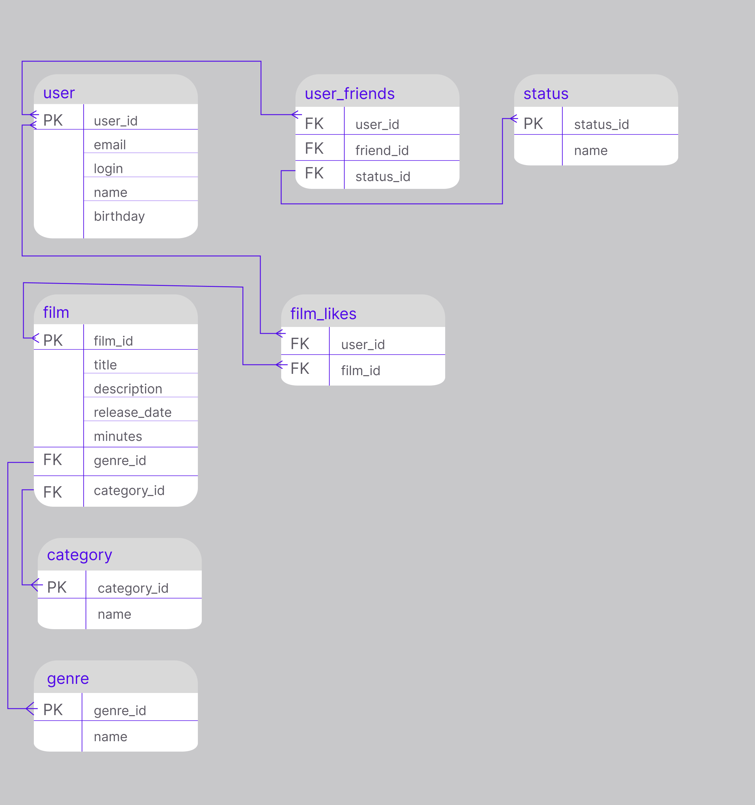

# java-filmorate

ER-диаграмма


# Описание
## user
Содержит данные о пользователях приложения.
Таблица включает такие поля:
- первичный ключ user_id - уникальный идентификатор пользователя;
- email - почта пользователя;
- login - логин пользователя;
- name - имя пользователя;
- birthday - дата рождения пользователя;

## user_friends
Содержит данные о друзьях пользователя и статус дружбы.
Таблица включает такие поля:
- внешний ключ user_id (ссылается на таблицу user) - идентификатор пользователя;
- внешний ключ friend_id (ссылается на таблицу user) - идентификатор друга;
- внешний ключ status_id (ссылается на таблицу status) - отображает статус дружбы:

## status
Содержит информацию о видах статусов дружбы.
Таблица включает такие поля:
- первичный ключ status_id - идентификатор статуса;
- name - название статуса, например: 
  - неподтверждённая,
  - подтверждённая;

## film
Содержит информацию о фильмах.
Таблица включает такие поля: 
- первичный ключ film_id - уникальный идентификатор фильма;
- title - название фильма;
- description - описание фильма;
- release_date  - дата выхода фильма;
- minutes - продолжительность фильма;
- внешний ключ genre_id (ссылается на таблицу genre) - уникальный идентификатор жанра;
- внешний ключ category_id (ссылается на таблицу category) - уникальный идентификатор категории фильма;

## category
Содержит информацию о категории фильма. 
Таблица включает такие поля: 
- первичный ключ category_id - уникальный идентификатор категории;
- name - название категории, например: 
  - G — у фильма нет возрастных ограничений, 
  - PG — детям рекомендуется смотреть фильм с родителями, 
  - PG-13 — детям до 13 лет просмотр не желателен, 
  - R — лицам до 17 лет просматривать фильм можно только в присутствии взрослого, 
  - NC-17 — лицам до 18 лет просмотр запрещён;

## genre
Содержит информацию о жанре фильма.
Таблица включает такие поля:
- первичный ключ genre_id - уникальный идентификатор жанра;
- name - название жанра, например:
  - комедия, 
  - драма, 
  - мультфильм, 
  - триллер, 
  - документальный, 
  - боевик;


## films_like
Содержит информацию о фильмах и пользователях, которые поставили лайки фильмам.
Таблица включает такие поля:
- внешний ключ film_id (ссылается на таблицу film) - id фильма, которому поставили лайк;
- внешний ключ user_id (ссылается на таблицу user) - id пользователя, который поставил лайк;


# Примеры запросов для основных операций приложения
Запрос на получение всех пользователей
```roomsql
SELECT *
FROM user;
```

Запрос на получение пользователя по его id
```roomsql
SELECT *
FROM user
WHERE user_id=‘id’;
```

Запрос на получение всех друзей пользователя по id
```roomsql
SELECT name
FROM user 
WHERE user_id IN (SELECT friend_id
                  FROM user_friends
	          WHERE user_id=‘id’);
```

Запрос на получение общих друзей 2-х пользователей по их id
```roomsql
SELECT name
FROM user
WHERE user_id IN (SELECT friend_id
                  FROM user_friends
		  WHERE user_id=‘user_1_id’ 
		  AND friend_id IN 
		      (SELECT friend_id
                       FROM user_friends
		       WHERE user_id=‘user_2_id’));
```

Запрос на получение всех фильмов
```roomsql
SELECT *
FROM film;
```

Запрос на получение фильма по его id
```roomsql
SELECT *
FROM film
WHERE film_id=‘id’;
```
Запрос на получение топ N фильмов 
```roomsql
SELECT title
FROM film AS f JOIN ON (SELECT film_id, 
                       COUNT(user_id) as likes_count
                       FROM film_like
                       GROUP BY film_id) 
AS film_likes_count ON f.film_id = film_likes_count.film_id
ORDER BY film_likes_count.likes_count DESC
LIMIT N;
```